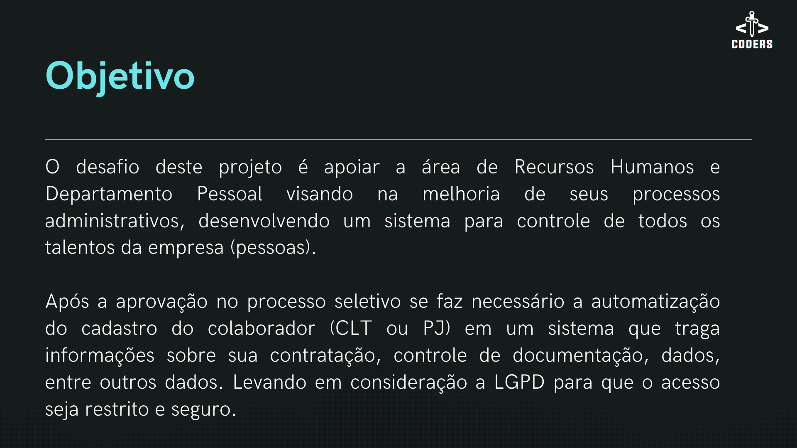
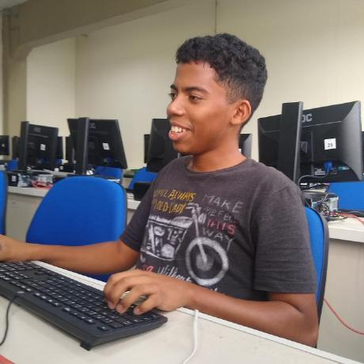

# Projeto IonicRH


<p align="center">
  <a href ="#o-projeto"> Projeto </a>  • 
  <a href ="#dart-proposta"> Proposta </a>  • 
  <a href ="#mapa-mental-do-produto"> Mapa Mental do Produto </a>  • 
  <a href ="#calendar-cronograma-das-entregas"> Cronograma das Entregas </a>  • 
  <a href ="#-tecnologias-utilizadas"> Tecnologias Utilizadas </a>  • 
  <a href ="#backlog-do-produto">Backlog do Produto </a>  •
  <a href ="#backlog-das-sprints">Backlog das Sprints </a>  •
  <a href ="#passo-a-passo-da-instalação-do-sistema">Passo a Passo da Instalação do Sistema </a>  •
  <a href ="#equipe"> Equipe </a> 
</p>

<br>
 
## :dart: Proposta

**Desenvolver um sistema de apoio a Gestão de Departamento Pessoal com os seguintes requisitos:**<br><br>

> **Requisitos Funcionais**

-  Cadastro de Colaboradores;
-  Repositório para documentos dos Colaboradores;
-  Cadastros de Trilha de Aprendizado e Status de Realização;
-  Usuários devem ter perfis diferentes (administrador, gestor, consultor, colaborador);
-  Organograma da Empresa;
-  Repositório de documentos da empresa (políticas, normas, regras, etc);
-  Upload e Download de documentos para consulta do Administrador e Gestor.
  <br>

> **Requisitos não Funcionais**
-  Linguagens NodeJS, TypeScript, Javascript;
-  Banco de Dados Relacional;
-  Manual do usuário para navegação.

<br>


## :calendar: Cronograma das Entregas

-  [SPRINT 0 (Kick Off)](https://github.com/excalibur-coders/IONICRH/releases/tag/sprint0) - 18/03/2022 a 24/03/2022
-  [SPRINT 1](https://github.com/excalibur-coders/IONICRH/releases/tag/sprint1) - 25/03/2022 a 14/04/2022
-  [SPRINT 2](https://github.com/excalibur-coders/IONICRH/releases/tag/sprint2) - 25/04/2022 a 15/05/2022
-  [SPRINT 3](https://github.com/excalibur-coders/IONICRH/releases/tag/sprint3) - 16/05/2022 a 05/06/2022


> Status do Projeto: Concluído

<br>

## O Projeto




<br>

<br>

## 💻 Tecnologias Utilizadas


- **Banco de Dados:** MySQL;
- **Back-end:** NodeJS, JWT Jason Web Token, AWS;
- **Front-end:** HTML, CSS, JavaScript, ChackaUi, React, Typescript, Vercel;
- **Deploy:** Heroku;
- **Ferramentas:** Visual Studio Code, Jira, Miro, Canva, Trello, Git e Github;
- **Metodologia Utilizada:** Metodologia Ágil | SCRUM


<br>

## Backlog do Produto


<br>

## Passo a Passo da Instalação do Sistema

```bash
git clone https://github.com/excalibur-coders/IONICRH.git
```

Instalar as dependências dentro de cada pastas:

```bash
cd ionic_rh_front e cd ionic_rh_back
```

Em cada uma rodar o comando:

```bash
npm install / yarn install
```

Na pasta backend mudar o nome do arquivo:

```bash
.envcopy para .env
```

### Dentro do env é necessário colocar as configurações do seu conector MySQL;

### Importante criar a database que deseja armazenar, as tabelas e afins:

```bash
Create database [nome]
```

Alterar dados de acordo com seu ambiente:

```bash
HOST = [host MySQL ou localhost]
```

```bash
PORT = 3306
```

```bash
DB_USERNAME = [usuario que deseja conectar]
```

```bash
DB_PASSWORD = [senha banco de dados]
```

```bash
DATABASE = [database que deseja que seja armazenado as tabelas]
```

Salvar o arquivo .env;

Após instalar as dependências, iniciar o serviço em cada uma das pasta

```bash
npm start / yarn dev
```

<br>

## Equipe

<br>

| Nome                 | Função         | Linkedin                                                                      | GitHub                                        | Avatar                                         |
| -------------------- | -------------- | ----------------------------------------------------------------------------- | --------------------------------------------- | ---------------------------------------------- |
| **Lucas Braz Dias**  | Scrum Master   | [@LinkedIn](https://www.linkedin.com/in/lucas-braz-dias/)                     | [@GitHub](https://github.com/lucasbdias)      |    |
| **Priscila Silva**   | Product Owner  | [@LinkedIn](https://www.linkedin.com/in/priscilasilva1801/)                   | [@GitHub](https://github.com/prsilva)         |  |
| **Taís Salomão**     | Desenvolvedora | [@LinkedIn](https://www.linkedin.com/in/tais-salomao/)                        | [@GitHub](https://github.com/taissalomao)     |          |
| **Kevin Mirenda**    | Desenvolvedor  | [@LinkedIn](https://www.linkedin.com/in/kevin-mirenda-a54a64220)              | [@GitHub](https://github.com/KevinFMfatec)    |        |
| **Lucas Costa**      | Desenvolvedor  | [@LinkedIn](https://www.linkedin.com/in/lucas-costa-a49a01219/)               | [@GitHub](https://github.com/ddaiwon)         |      |
| **Gabriel Souza**    | Desenvolvedor  | [@LinkedIn](https://www.linkedin.com/in/gabriel-souza-bicho-nunes-429191185/) | [@GitHub](https://github.com/ZeroPirata)      |    |
| **Vinicius Andrade** | Desenvolvedor  | [@LinkedIn](https://www.linkedin.com/in/vin%C3%ADcius-barbosa-78111a206/)     | [@GitHub](https://github.com/ViniciusAndBar)  |  |

<br>
