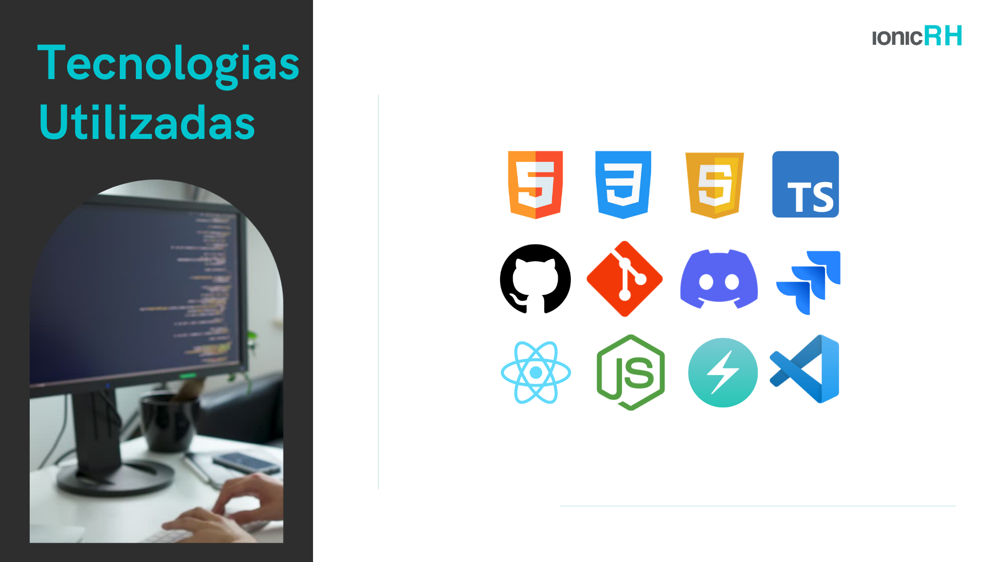

# Projeto IonicRH


<p align="center">
  <a href ="#o-projeto"> Projeto </a>  • 
  <a href ="#dart-proposta"> Proposta </a>  • 
  <a href ="#calendar-cronograma-das-sprints"> Sprints </a>  • 
  <a href ="#computer-tecnologias-utilizadas"> Tecnologias </a>  • 
  <a href ="#product-backlog">Backlog do Produto </a>  •
  <a href ="#sprints-backlog">Backlog das Sprints </a>  •
  <a href ="#instalacao">Passo a Passo da Instalação</a>  •
  <a href ="#equipe"> Equipe </a> 
</p>


## O Projeto


<br>

> Status do Projeto: Em andamento 

<br>

## :dart: Proposta

**Desenvolver um sistema de apoio a Gestão de Departamento Pessoal com os seguintes requisitos:**<br><br>

 > **Requisitos**

 -  Cadastro de Colaboradores;
 -  Repositório para documentos dos colaboradores;
 -  Cadastros de Trilha de Aprendizado e Status de Realização;
 -  Organogramas da Empresa;
 -  Repositório de documentos da empresa (políticas, normas, regras, etc);
 -  Dossiê gerado em PDF por colaborador para consulta do administrador e gestor.<br><br>

 > **Funcionalidades extras**

 -   ;
 -   ;
 -   <br><br>

<br>


## :calendar: Cronograma das Entregas

-  [SPRINT 0](https://github.com/excalibur-coders/IONICRH/releases/tag/sprint0) - 18/03/2022 a 24/03/2022
-  [SPRINT 1](https://github.com/excalibur-coders/IONICRH/releases/tag/sprint1) - 25/03/2022 a 14/04/2022
-  [SPRINT 2](https://github.com/excalibur-coders/IONICRH/releases/tag/sprint2) - 25/04/2022 a 15/05/2022
-  [SPRINT 3](https://github.com/excalibur-coders/IONICRH/releases/tag/sprint3) - 16/05/2022 a 05/06/2022

<h1 align="center"> </h1>

<br>

## 💻 Tecnologias Utilizadas


* **Banco de Dados:** MySQL;
* **Back-end:** NodeJS;
* **Front-end:** HTML, CSS, JavaScript, ChackaUi, React, Typescript ;
* **Ferramentas:** Visual Studio Code, Jira, Miro, Canva, Trello, Git e Github;
* **Metodologia Utilizada: Metodologia Ágil: SCRUM

<br>

## Product Backlog

<h1 align="center"> </h1> 

<br>

## Sprints Backlog 

<h1 align="center"> </h1> 

<br>


## Passo a passo da instalação do sistema

```bash
git clone https://github.com/excalibur-coders/IONICRH.git
```

Instalar as dependências dentro de cada pastas:

```bash
cd ionic_rh_front e cd ionic_rh_back
```

Em cada uma rodar o comando:

```bash
npm install / yarn install
```

Na pasta backend mudar o nome do arquivo:

```bash
.envcopy para .env
```

## Dentro do env é necessário colocar as configurações do seu conector MySQL;

## Importante criar a database que deseja armazenar, as tabelas e afins:

```bash
Create database [nome]
```

Alterar dados de acordo com seu ambiente:

```bash
HOST = [host MySQL ou localhost]
```

```bash
PORT = 3306
```

```bash
DB_USERNAME = [usuario que deseja conectar]
```

```bash
DB_PASSWORD = [senha banco de dados]
```

```bash
DATABASE = [database que deseja que seja armazenado as tabelas]
```

Salvar o arquivo .env;

Após instalar as dependências, iniciar o serviço em cada uma das pasta

```bash
npm start dev ou  yarn dev
```

<br>

## Equipe 

<br>

|Nome|Função|Linkedin|GitHub|Avatar|
| -------- |-------- |-------- |-------- |-------- |
|**Lucas Braz Dias**|Scrum Master|[@LinkedIn](https://www.linkedin.com/in/lucas-braz-dias/)|[@GitHub](https://github.com/lucasbdias)||
|**Priscila Silva**|Product Owner|[@LinkedIn](https://www.linkedin.com/in/priscilasilva1801/)|[@GitHub](https://github.com/prsilva)||
|**Taís Salomão**|Desenvolvedora|[@LinkedIn](https://www.linkedin.com/in/tais-salomao/)|[@GitHub](https://github.com/taissalomao)||
|**Kevin Mirenda**|Desenvolvedor|[@LinkedIn](https://www.linkedin.com/in/kevin-mirenda-a54a64220)|[@GitHub](https://github.com/KevinFMfatec)||
|**Rafael Lopes**|Desenvolvedor|[@LinkedIn](https://www.linkedin.com/in/rafael-leonardo-lopes/)|[@GitHub](https://github.com/Rafael-leonardo)||
|**Lucas Costa**|Desenvolvedor|[@LinkedIn](https://www.linkedin.com/in/lucas-costa-a49a01219/)|[@GitHub](https://github.com/lucasdwn)||
|**Gabriel Souza**|Desenvolvedor|[@LinkedIn](https://www.linkedin.com/in/gabriel-souza-bicho-nunes-429191185/)|[@GitHub](https://github.com/ZeroPirata)||
|**Vinicius Andrade**|Desenvolvedor|[@LinkedIn](https://www.linkedin.com/in/vin%C3%ADcius-barbosa-78111a206/)|[@GitHub](https://github.com/ViniciusAndBar)||

<br>

