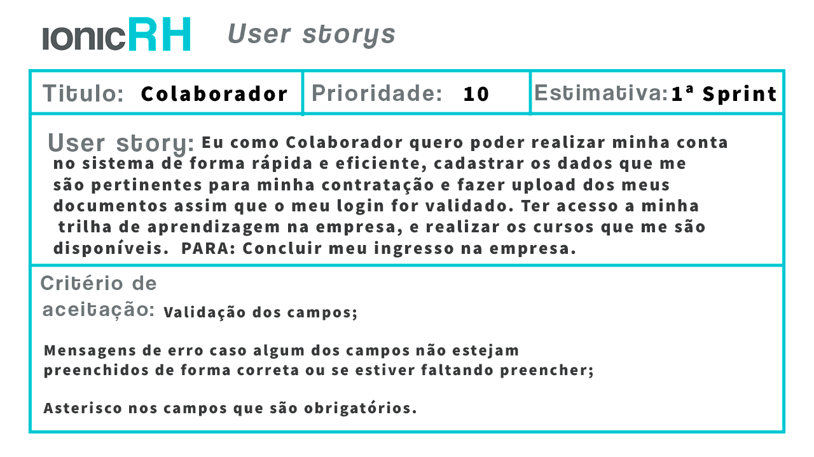
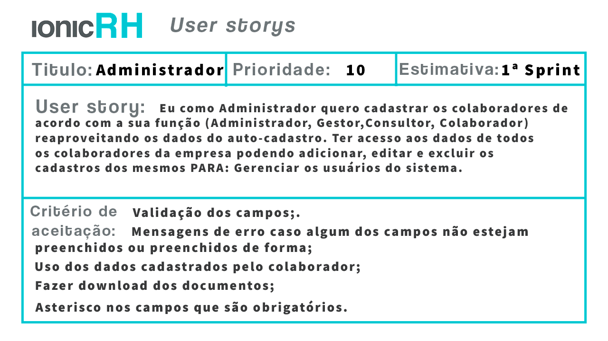
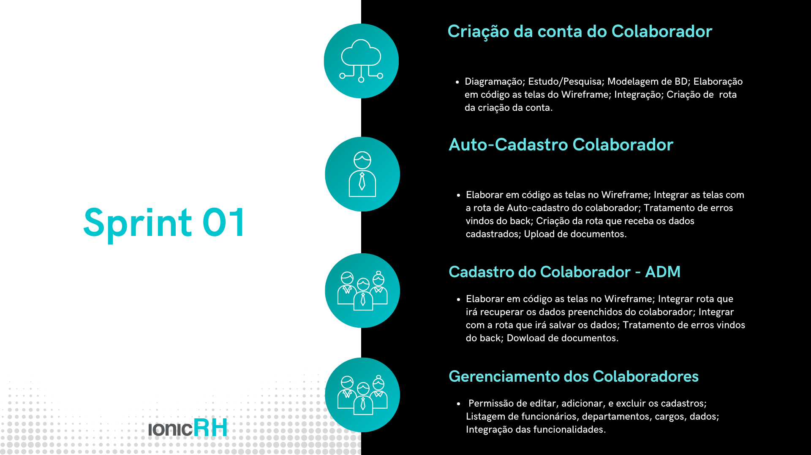
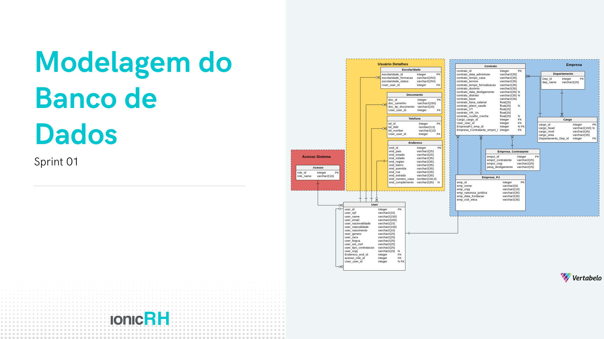
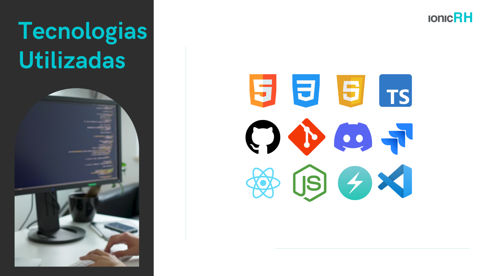

# Projeto IonicRH

- Lucas Braz Dias (Scrum Master)

#### [Linked](https://www.linkedin.com/in/lucas-braz-dias/) [Github](https://github.com/lucasbdias)

- Priscila Aparecida Silva (Produtc Owner)

#### [Linked](https://www.linkedin.com/in/priscilasilva1801/) [Github](https://github.com/prsilva)

- Tais Gomes Salomao (Dev Team)

#### [Linked](https://www.linkedin.com/in/tais-salomao) [Github](https://github.com/taissalomao)

- Rodrigo de Andrade Paula (Dev Team)

#### [Linked](https://www.linkedin.com/in/rodrigo-de-andrade-a34605104) [Github](https://github.com/RodrigodeAndrade90)

- Kevin Ferreira Mirenda (Dev team)

#### [Linked](https://www.linkedin.com/in/kevin-mirenda-a54a64220) [Github](https://github.com/KevinFMfatec)

- Rafael Leonardo Lopes (Dev Team)

#### [Linked](https://www.linkedin.com/in/rafael-leonardo-lopes/) [Github](https://github.com/Rafael-leonardo)

- Lucas Ferreira da Costa (Dev Team)

#### [Linked](https://www.linkedin.com/in/lucas-costa-a49a01219/) [Github](https://github.com/ddaiwon)

- Gabriel Souza Bicho Nunes (Dev Team)

#### [Linked](https://www.linkedin.com/in/gabriel-souza-bicho-nunes-429191185/) [Github](https://github.com/ZeroPirata)

- Vinícius Andrade B. (Dev Team)

#### [Linked](https://www.linkedin.com/in/vin%C3%ADcius-barbosa-78111a206/) [Github](https://github.com/ViniciusAndBar)

## API 2º Semestre do Curso de Desenvolvimento de Software Multiplataforma

- M2: Prof. José Walmir Gonçalves Duque
- P2: Prof. Claudio Etelvino de Lima

## Objetivo do Projeto

## _User Story_

## Backlog da Sprint

## Modelo de Banco de Dados

## Tecnologias Utilizadas

## Sistema Desenvolvido

## Cronograma de Entregas

| Data       | Links      |
| ---------- | ---------- |
| 14/04/2022 | [Sprint 1] |
| 15/05/2022 | [Sprint 2] |
| 05/06/2021 | [Sprint 3] |
